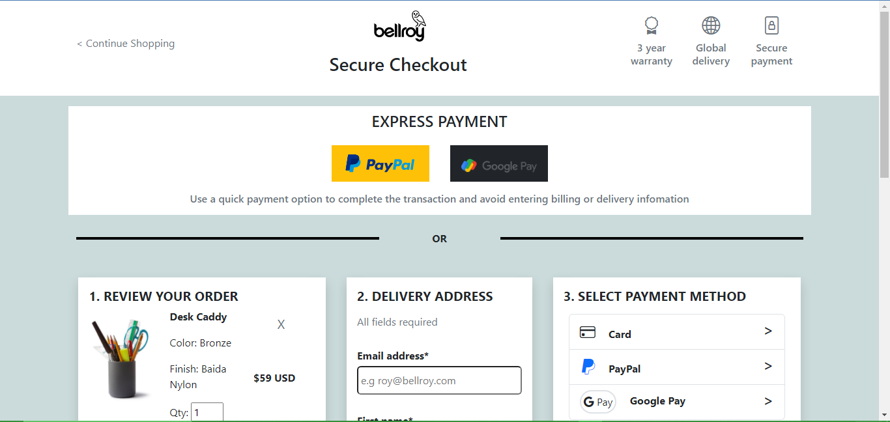
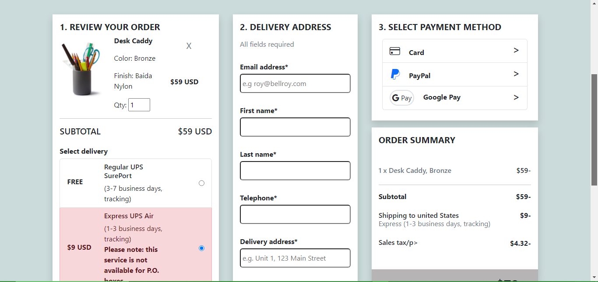
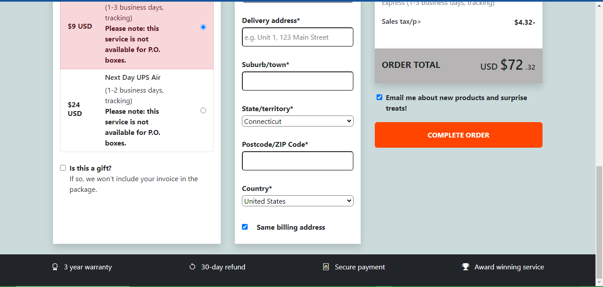
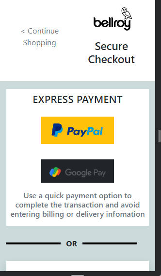
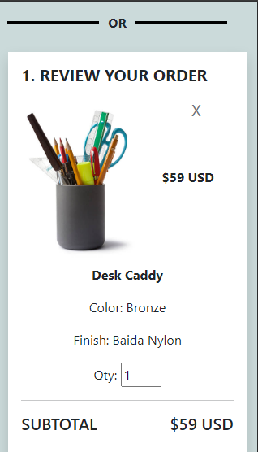
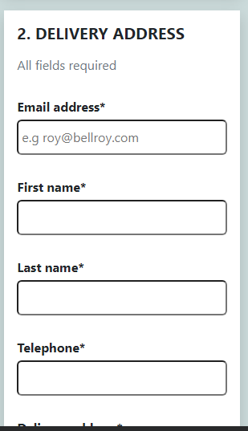
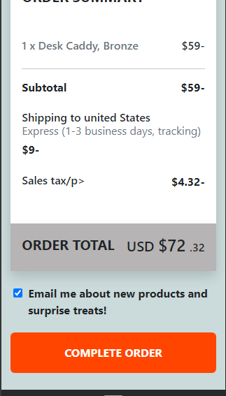

# DailyUI challenge 2 - A checkout page.

This was an interesting project that i really enjoyed. I like transforming great designs, no matter how challenging, to reality and this was on of those.

### Desktop View

### Mobile View

  
  
  
  
  

